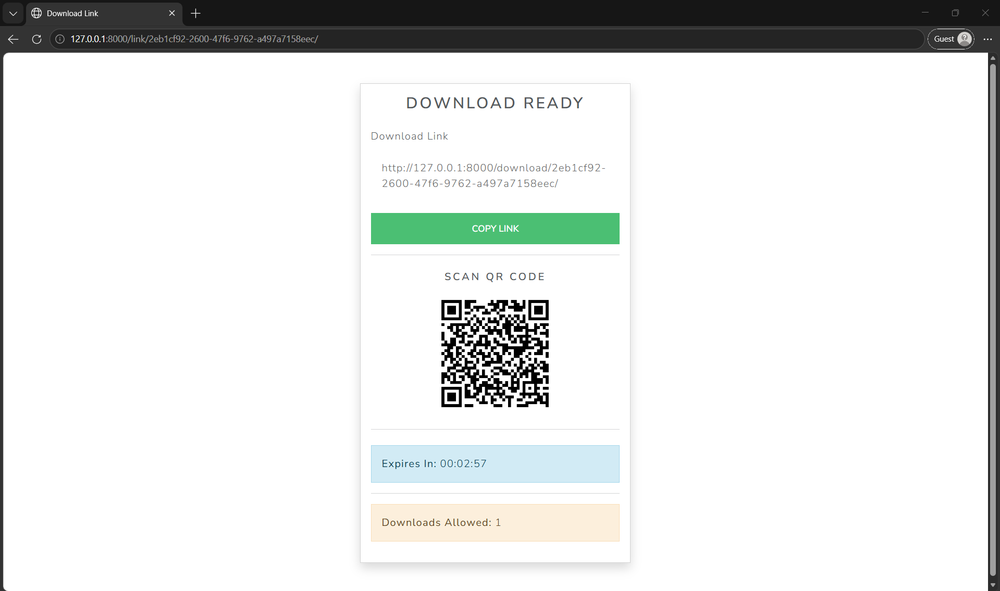
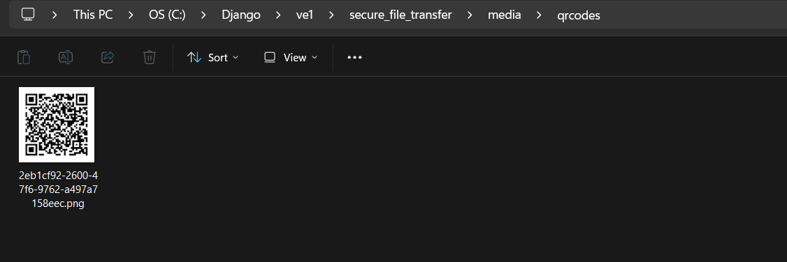
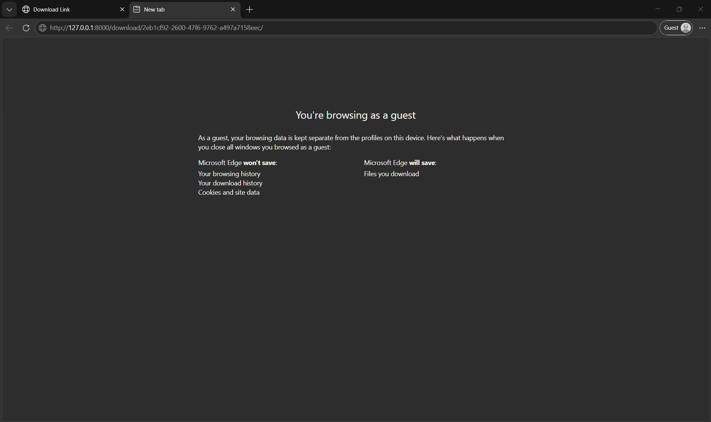
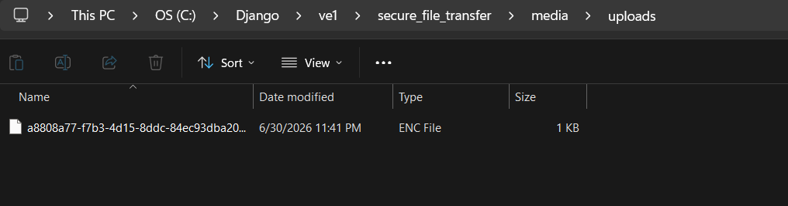
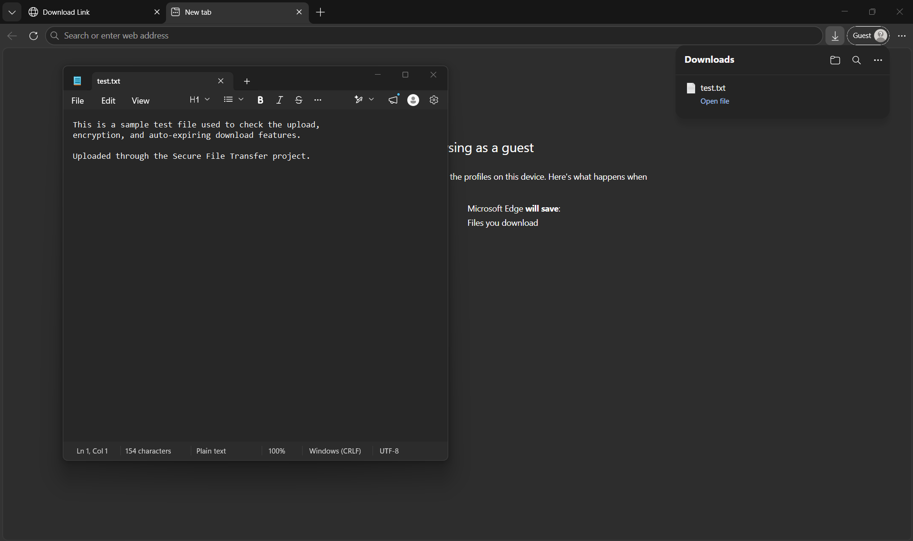
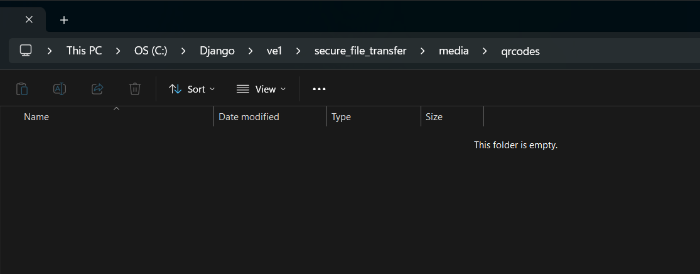

# 🔐 Secure File Transfer


A Django web application that lets users upload files, encrypts them at rest with **Fernet (AES-128-CBC + HMAC-SHA256)**, and hands the recipient a one-time shareable link and QR code. Links expire by time and by download count, and the encrypted blobs are scrubbed automatically once either limit is hit.

> Files are encrypted on the server before being persisted to permanent storage and are never stored unencrypted in application-managed storage. Once expired or fully downloaded, the file, its QR code, and the database row are all wiped.

---

## ✨ Features

- **Server-side at-rest encryption** using [`cryptography`](https://cryptography.io/) Fernet.
- **Self-destructing share links** — bounded by expiry time *and* max download count, whichever comes first.
- **QR code generation** for every upload so recipients can scan and grab the file on mobile.
- **Race-safe download counter** — `select_for_update()` + `F()` expression inside `transaction.atomic()`, backed by row-level locking in production DBs like PostgreSQL. Concurrent requests can't both claim the last allowed download.
- **Background cleanup** via APScheduler — expired files are wiped every minute.
- **Strict upload validation** — file size, extension, and MIME-type checks; `10 MB` cap.
- **Friendly UI** with a live countdown timer, copy-to-clipboard, and Bootstrap styling.
- **Tested** — round-trip encryption, form validation, download quota, and expiry cleanup all covered.

---

## 🏗 Architecture

The system has two flows: **upload → encrypt → share**, and **download → decrypt → cleanup**.

### Upload Flow

```
   ┌──────────┐    HTTP POST      ┌──────────────────┐
   │  Sender  │ ─────────────────▶│  Django (views)  │
   │  Browser │   multipart/form  │   upload view    │
   └──────────┘                   └────────┬─────────┘
                                           │
                          UploadForm.clean()│  (size, ext, MIME)
                                           ▼
                                ┌─────────────────────┐
                                │  crypto_utils.py    │
                                │  Fernet.encrypt()   │
                                │  (AES-128 + HMAC)   │
                                └────────┬────────────┘
                                         │
                          ciphertext     │
                          written to     ▼
                                ┌─────────────────────┐
                                │  MEDIA_ROOT/<uuid>  │
                                │  (encrypted blob)   │
                                └────────┬────────────┘
                                         │
                                         ▼
                              ┌──────────────────────┐
                              │  FileUpload row in   │
                              │  DB (id, key, expiry,│
                              │  max_downloads, n)   │
                              └────────┬─────────────┘
                                       │
                                       ▼
                            ┌──────────────────────┐
                            │  QR + shareable URL   │
                            │  returned to sender   │
                            └──────────────────────┘
```

### Download Flow

```
   ┌────────────┐    GET /d/<id>/    ┌──────────────────┐
   │ Recipient  │ ──────────────────▶│  download view   │
   │  Browser   │                    └────────┬─────────┘
   └────────────┘                             │
                          transaction.atomic() │  select_for_update
                                  + F('max_downloads') - 1
                                             ▼
                              ┌──────────────────────────┐
                              │ Quota hit? Expired?       │
                              │  → delete blob, QR, row   │
                              │    render "expired.html"  │
                              └────────┬─────────────────┘
                              not yet  │
                                       ▼
                            ┌──────────────────────┐
                            │ crypto_utils.py      │
                            │ Fernet.decrypt()     │
                            │ → FileResponse       │
                            └──────────────────────┘
```

### Background Cleanup

```
   ┌────────────────────┐   every 60s   ┌────────────────────┐
   │ APScheduler        │──────────────▶│ cleanup.delete_    │
   │ (uploader.apps)    │               │   expired()        │
   └────────────────────┘               └────────┬───────────┘
                                                 │
                                                 ▼
                                       DELETE blob, QR, DB row
                                       for every FileUpload whose
                                       expires_at < now()
                                       or max_downloads == 0
```

### Why these design choices

- **Encrypt before disk, not after.** Plaintext never hits the filesystem, even briefly. The `UploadForm` writes the raw upload to a temp buffer, the view encrypts it, and only the ciphertext is written to `MEDIA_ROOT`.
- **`select_for_update` + `F()`** locks the row during the decrement so two simultaneous downloads cannot both claim the final slot — the second request sees `max_downloads == 0` and is treated as expired.
- **APScheduler bootstrap in `AppConfig.ready()`** with guards to prevent duplicate scheduler instances during Django's dev-server auto-reloads. Cleanup runs as long as the Django process is alive, without needing Celery or a separate worker for this single task.
- **UUID-based download URL** (not the DB id) so links aren't enumerable.

---

## 🛠 Tech Stack

| Layer       | Technology                                  |
|-------------|---------------------------------------------|
| Backend     | Django 5.2                                  |
| Database    | SQLite (default)                            |
| Encryption  | `cryptography` (Fernet / AES-128-CBC)       |
| QR Codes    | `qrcode`                                    |
| Scheduler   | `APScheduler` (background)                  |
| Frontend    | Bootstrap 5 (via CDN templates)              |
| Tests       | Django `TestCase` + `override_settings`      |

---

## 📂 Project Structure

```
secure_file_transfer/
├── manage.py
├── secret.key                 # Fernet key (auto-generated, gitignored)
├── db.sqlite3                 # Dev database (gitignored)
├── media/                     # Encrypted blobs + QR codes (gitignored)
├── secure_file_transfer/      # Django project package
│   ├── settings.py
│   ├── urls.py
│   ├── wsgi.py
│   └── asgi.py
└── uploader/                  # Main app
    ├── models.py              # FileUpload model
    ├── views.py               # upload / link / download views
    ├── forms.py               # UploadForm with validation
    ├── crypto_utils.py        # Fernet encrypt/decrypt helpers
    ├── cleanup.py             # File deletion + scheduled expiry job
    ├── scheduler.py           # APScheduler bootstrap
    ├── apps.py                # AppConfig that starts the scheduler
    ├── admin.py               # Django admin registration
    ├── urls.py
    ├── tests.py
    ├── management/
    │   └── commands/
    │       └── generate_key.py
    └── templates/
        ├── base.html
        ├── upload.html
        ├── link.html
        └── expired.html
```

---

## 🚀 Getting Started

### 1. Prerequisites

- Python **3.10+**
- pip
- (Recommended) a virtual environment

### 2. Clone & Install

```bash
git clone https://github.com/poojashree1375/secure-file-transfer-django.git
cd secure_file_transfer

python -m venv venv
# Windows
venv\Scripts\activate
# macOS / Linux
source venv/bin/activate

pip install -r requirements.txt
```

### 3. Generate the Encryption Key

The Fernet key is stored in `secret.key` next to `manage.py`. Generate it once:

```bash
python manage.py generate_key
```

> ⚠ **Never commit `secret.key`.** It's already in `.gitignore`. If you lose it, all previously encrypted files become unreadable.

### 4. Apply Migrations

```bash
python manage.py migrate
```

### 5. Create a Superuser (optional, for the admin)

```bash
python manage.py createsuperuser
```

### 6. Run the Server

```bash
python manage.py runserver
```

Visit **http://127.0.0.1:8000/** to upload a file.

---

## 🧑‍💻 Usage

1. **Upload** a file (`PDF`, `TXT`, `PNG`, `JPG`, `DOCX`, or `ZIP`), pick an **expiry in minutes**, and choose a **max download count**.
2. After upload you'll be redirected to a page showing:
   - The **download link**
   - A **QR code** for the link
   - A **live countdown** to expiry
   - The **remaining download count**
3. Share the link (or QR code) with your recipient.
4. Once the link expires *or* the download cap is hit, the encrypted blob, QR code, and database row are all deleted — subsequent requests see a "File Unavailable" page.

---

## 📸 Screenshots

### Starting the App


*The Django development server running locally. Visit http://127.0.0.1:8000/ to start uploading.*

### Upload Flow


*The upload form — pick a file, set an expiry time in minutes, and choose a max download count.*


*After a successful upload: a one-time shareable link, a live countdown to expiry, and the remaining download count.*


*The QR code is generated server-side and stored alongside the encrypted blob so recipients can scan and grab the file on mobile.*

### Download Flow


*The recipient opens the shareable link in their browser.*


*The decrypted file is delivered to the recipient. The download counter ticks down atomically — no two requests can claim the final slot.*

### Encryption Proof


*What's actually written to disk — ciphertext, not plaintext. Even with full access to `MEDIA_ROOT`, the file is unreadable without the Fernet key.*


*After decryption on download, the bytes match the original upload — round-trip integrity confirmed.*


*The original file as uploaded by the sender, for direct comparison with the decrypted output above.*

### Auto-Cleanup Proof


*Once the link expires or the download cap is hit, the encrypted blob is wiped from `MEDIA_ROOT` automatically — no manual cleanup needed.*


*The QR code is removed alongside the encrypted blob. Subsequent requests to the link render the "File Unavailable" page.*

---

## 🔒 Security Notes

- **At-rest encryption:** every uploaded file is encrypted with Fernet before it touches disk. The decryption key never leaves the server.
- **Tamper detection:** Fernet authenticates ciphertext with HMAC; tampered files raise `InvalidToken` and are treated as expired.
- **Race-safe quota:** the download counter is incremented inside a `transaction.atomic()` block with `select_for_update()` so two simultaneous downloads can't both win the last slot.
- **Defence-in-depth on uploads:** the form checks size, extension, *and* MIME type. **Note:** the MIME check uses the browser-supplied `content_type` header, which a malicious client can forge — for production, swap it for a magic-byte check via `python-magic` (libmagic) so the type is derived from the file's actual bytes, not its claimed type. This is tracked as a deployment-time task.
- **Auto-cleanup:** APScheduler runs `delete_expired` every minute so stale blobs don't pile up.
- **Production checklist:**
  - Set `DEBUG = False`
  - Move `SECRET_KEY` and the Fernet key to environment variables
  - Switch SQLite → PostgreSQL
  - Serve `MEDIA_ROOT` from private storage (not a public CDN)
  - Add HTTPS + rate limiting
  - Implement magic-byte content-type validation via `python-magic` (the current MIME check is client-supplied and forgeable)

---

## 🧪 Running the Tests

```bash
python manage.py test
```

The suite covers:

- `EncryptionRoundTripTest` — encrypt → decrypt returns the original bytes
- `UploadFormValidationTest` — bad extensions and oversize files are rejected
- `DownloadLimitTest` — quota decrements correctly and the file is wiped at the cap
- `ExpiryTest` — past-due files render the expired page and are cleaned up
- `ShowLinkExpiredTest` — expired or fully-spent files render the expired page on the link view

Tests write uploads to a temporary `MEDIA_ROOT` so they never touch your real `media/` folder.

---

## ⚙️ Configuration

| Setting                | Default                  | Where                |
|------------------------|--------------------------|----------------------|
| Max upload size        | `10 MB`                  | `uploader/forms.py`  |
| Allowed extensions     | `pdf, txt, png, jpg, jpeg, docx, zip` | `uploader/forms.py` |
| Allowed MIME types     | See `ALLOWED_TYPES`      | `uploader/forms.py`  |
| Cleanup interval       | Every 1 minute           | `uploader/scheduler.py` |
| Time zone              | `Asia/Kolkata`           | `settings.py`        |

---

## ⚠ Challenges Faced

A handful of issues came up during the build that are worth documenting:

- **Race condition on the download quota.** The naive `downloads_left = row.max_downloads - 1; row.save()` approach lets two concurrent requests both think they got the last slot. **Fix:** wrapped the read-and-decrement in `transaction.atomic()` with `select_for_update()` and used an `F()` expression so the row is locked for the duration of the transaction and the decrement happens in SQL, not in Python.
- **APScheduler lifecycle in Django.** APScheduler doesn't auto-stop when Django's dev server reloads, which leaks threads on every code change. **Fix:** hook `scheduler.shutdown()` into Django's `AppConfig.ready()` so a single scheduler instance is started per process, and rely on `runserver`'s auto-reloader *not* spawning the app twice (the `apps.py` guards against that).
- **MIME-type validation that isn't actually trustworthy.** I initially planned to validate by `request.FILES['file'].content_type`, but realised that header is set by the client and can be anything — a `.exe` can pretend to be a `.pdf`. **Fix (partial):** kept the client-supplied MIME check as a first line of defence, but documented the proper fix as magic-byte detection with `python-magic`. This is left as a deployment task because adding `libmagic` as a system dependency is a deployment-environment concern, not a code one.
- **Fernet key loss = total data loss.** If `secret.key` is deleted or rotated without re-encrypting, every previously uploaded file becomes unreadable. **Fix:** the key path is documented in the README, the file is gitignored, and the `generate_key` management command makes the bootstrap explicit. A future improvement would be to store the key in an env var or KMS.
- **Stale blobs from expired downloads.** Without a background job, files whose quota hits zero just sit on disk forever. **Fix:** APScheduler-driven `delete_expired()` runs every minute. The download view also deletes inline as a defence-in-depth measure so a user who hits the cap doesn't have to wait up to 60s for the file to vanish.

---

## 📜 License

This project is released under the **MIT License**. See [`LICENSE`](LICENSE) for details.

---

## 🙋‍♀️ Author

Built by Pooja Shree R

Computer Science Engineering Student  
Interested in Cybersecurity and Backend Development

Feel free to connect or contribute.