# 🔐 Secure File Transfer


A Django web app where signed-in users upload files, the server encrypts them at rest with **Fernet (AES-128-CBC + HMAC-SHA256)**, and the recipient gets a short shareable link and QR code. Links expire by time or by download count, and the encrypted blob is scrubbed once either limit is hit.

> Files are encrypted on the server before being persisted to `MEDIA_ROOT` and are never stored unencrypted. Once expired or fully downloaded, the file, its QR code, and the database row are wiped — a `DeletedUpload` row is written first so the dashboard can still show what happened.

---

## Key Highlights

- 🔒 Files are encrypted with Fernet (AES-128-CBC + HMAC-SHA256) before they touch disk
- 🔗 Share links expire by time or by download count, whichever comes first
- 👤 Email-based login with a personal dashboard for every user
- 📱 Every upload gets a QR code so recipients can grab the file on mobile
- 🧹 APScheduler wipes expired blobs and their QR codes every minute

---

## Features

### Security

- **Server-side at-rest encryption** using [`cryptography`](https://cryptography.io/) Fernet — plaintext never hits disk.
- **Strict upload validation** — file size, extension, and MIME-type checks; `10 MB` cap.
- **Race-safe download counter** — `select_for_update()` + `F()` inside `transaction.atomic()` so two simultaneous downloads can't both claim the last allowed slot.
- **DeletedUpload audit log** — every wipe (manual, expiry, or quota-reached) is recorded before the ciphertext is removed, so the dashboard shows what happened.

### Sharing & User Experience

- **Self-destructing share links** — bounded by expiry time *and* max download count, whichever comes first.
- **Short 22-character tokens** — base64-url encoded, clean in URLs and QR codes, with the same 128-bit entropy as a UUID4.
- **Email-based authentication** via `django-allauth` — sign up and log in with just an email and password.
- **Personal dashboard** for the logged-in user — lists every upload plus the delete history, with status badges, one-click link copy, and owner-only manual delete.
- **QR code generation** for every upload so recipients can scan and grab the file on mobile.
- **Friendly UI** — live countdown timer, copy-to-clipboard, Bootstrap 5 styling.

### Backend & Reliability

- **Background cleanup** via APScheduler — expired files are wiped every minute.
- **Tested** — round-trip encryption, form validation, download quota, and expiry cleanup are covered.

---

## Architecture

Four flows: **upload → encrypt → share**, **download → decrypt → cleanup**, **auth + dashboard**, and the **APScheduler sweeper**.

### Upload Flow

```
   ┌──────────┐    HTTP POST      ┌──────────────────┐
   │  Sender  │ ─────────────────▶│  Django (views)  │
   │  Browser │   multipart/form  │   upload view    │
   └──────────┘                   └────────┬─────────┘
                                           │
                          UploadForm.clean()│  (size, ext, MIME)
                                           ▼
                                ┌─────────────────────┐
                                │  crypto_utils.py    │
                                │  Fernet.encrypt()   │
                                │  (AES-128 + HMAC)   │
                                └────────┬────────────┘
                                         │
                          ciphertext     │
                          written to     ▼
                                ┌─────────────────────┐
                                │  MEDIA_ROOT/<uuid>  │
                                │  (encrypted blob)   │
                                └────────┬────────────┘
                                         │
                                         ▼
                              ┌──────────────────────┐
                              │  FileUpload row in   │
                              │  DB (id, key, expiry,│
                              │  max_downloads, n)   │
                              └────────┬─────────────┘
                                       │
                                       ▼
                            ┌──────────────────────┐
                            │  QR + shareable URL   │
                            │  returned to sender   │
                            └──────────────────────┘
```

### Download Flow

```
   ┌────────────┐    GET /download/<token>/   ┌──────────────────┐
   │ Recipient  │ ───────────────────────────▶│  download view   │
   │  Browser   │ (22-char token, no auth)   └────────┬─────────┘
   └────────────┘                             │
                          transaction.atomic() │  select_for_update
                                  + F('max_downloads') - 1
                                             ▼
                              ┌──────────────────────────┐
                              │ Quota hit? Expired?       │
                              │  → delete blob, QR, row  │
                              │    write DeletedUpload   │
                              │    render "expired.html"  │
                              └────────┬─────────────────┘
                              not yet  │
                                       ▼
                            ┌──────────────────────┐
                            │ crypto_utils.py      │
                            │ Fernet.decrypt()     │
                            │ → FileResponse       │
                            └──────────────────────┘
```

### Auth & Dashboard Flow

```
   ┌──────────┐  GET /  (anon)  ┌────────────────┐
   │ Visitor  │ ───────────────▶│ upload_file()  │
   └──────────┘                 │ redirects to   │
                                │ account_login  │
                                └───────┬────────┘
                                        │
                            sign up/in  │  (django-allauth, email + password)
                                        ▼
                                ┌────────────────┐
                                │ LOGIN_REDIRECT │
                                │  → / (upload)  │
                                └───────┬────────┘
                                        ▼
                                ┌────────────────┐         ┌──────────────────────┐
                                │ upload_file()  │────────▶│  FileUpload row      │
                                │  user=request  │         │  + 22-char token     │
                                │   .user        │         │  + user FK           │
                                └────────────────┘         └──────────┬───────────┘
                                                                     │
                                                                     ▼
                                                          ┌──────────────────────┐
                                                          │ GET /dashboard/      │
                                                          │ lists the user's     │
                                                          │ FileUpload rows      │
                                                          │ + DeletedUpload rows │
                                                          │  (status, copy link, │
                                                          │   owner-only delete) │
                                                          └──────────────────────┘
```

- **Downloads are unauthenticated** — recipients only need the token. The token is the capability.
- **Uploads, the dashboard, and manual delete all require login.** The `user` FK on `FileUpload` is the ownership boundary used by the dashboard query and the `delete_file` view (which 404s if the row's `user` doesn't match `request.user`).

### Background Cleanup

```
   ┌────────────────────┐   every 60s   ┌────────────────────┐
   │ APScheduler        │──────────────▶│ cleanup.delete_    │
   │ (uploader.apps)    │               │   expired()        │
   └────────────────────┘               └────────┬───────────┘
                                                 │
                                                 ▼
                                       DELETE blob, QR, DB row
                                       for every FileUpload whose
                                       expires_at < now()
                                       or max_downloads == 0
```

### Why these design choices

- **Encrypt before disk.** The view runs `Fernet.encrypt()` and writes only the ciphertext to `MEDIA_ROOT` — plaintext never touches the filesystem.
- **Locked counter.** `select_for_update()` + `F()` inside `transaction.atomic()` keeps two simultaneous downloads from both winning the last slot. Full story in [Challenges Faced](#-challenges-faced).
- **In-process scheduler.** APScheduler starts from `AppConfig.ready()` with reload-guards, so cleanup runs without a Celery or Redis dependency.
- **22-char tokens.** `tokens.generate_token()` base64-url-encodes 16 random bytes, strips `=` padding, and keeps the full 128-bit entropy of a UUID4.
- **Token-as-capability.** Downloads are unauthenticated (the token is the capability); the dashboard and manual delete are gated on the `user` FK, so a guessed token from another user's URL just 404s.
- **Soft delete with a reason.** `cleanup_file()` writes a `DeletedUpload` snapshot first, then removes the blob, QR, and `FileUpload` row — the dashboard merges active and deleted rows for a full history.

---

## Tech Stack

| Layer       | Technology                                  |
|-------------|---------------------------------------------|
| Backend     | Django 5.2                                  |
| Database    | SQLite (dev) / PostgreSQL (prod via `DATABASE_URL`) |
| Auth        | `django-allauth` (email + password)         |
| Forms       | `django-crispy-forms` + `crispy-bootstrap5` |
| Encryption  | `cryptography` (Fernet / AES-128-CBC)       |
| QR Codes    | `qrcode`                                    |
| Scheduler   | `APScheduler` (background)                  |
| Frontend    | Bootstrap 5 (via CDN templates)              |
| Tests       | Django `TestCase` + `override_settings`      |

---

## Project Structure

```
secure_file_transfer/
├── manage.py
├── secret.key                 # Fernet key (auto-generated, gitignored)
├── db.sqlite3                 # Dev database (gitignored)
├── media/                     # Encrypted blobs + QR codes (gitignored)
├── secure_file_transfer/      # Django project package
│   ├── settings.py            # allauth + crispy-forms config
│   ├── urls.py                # /accounts/ (allauth) + / (uploader)
│   ├── wsgi.py
│   └── asgi.py
└── uploader/
    ├── models.py              # FileUpload + DeletedUpload (audit log)
    ├── views.py               # upload / link / download / dashboard / delete
    ├── forms.py               # UploadForm (size, ext, MIME validation)
    ├── crypto_utils.py        # Fernet encrypt/decrypt
    ├── tokens.py              # 22-char URL-safe token generator
    ├── cleanup.py             # File deletion + scheduled expiry
    ├── scheduler.py           # APScheduler bootstrap
    ├── apps.py                # AppConfig that starts the scheduler
    ├── admin.py
    ├── urls.py                # /, /link/, /download/, /dashboard/, /delete/
    ├── tests.py
    ├── management/commands/generate_key.py
    └── templates/
        ├── base.html
        ├── upload.html
        ├── link.html
        ├── dashboard.html     # User-scoped active + deleted uploads
        ├── expired.html
        └── account/           # allauth templates (login, signup, logout)
```

---

## Getting Started

### 1. Prerequisites

- Python **3.10+**
- pip
- (Recommended) a virtual environment

### 2. Clone & Install

```bash
git clone https://github.com/poojashree1375/secure-file-transfer-django.git
cd secure_file_transfer

python -m venv venv
# Windows
venv\Scripts\activate
# macOS / Linux
source venv/bin/activate

pip install -r requirements.txt
```

### 3. Generate the Encryption Key

The Fernet key is stored in `secret.key` next to `manage.py`. Generate it once:

```bash
python manage.py generate_key
```

> ⚠ **Never commit `secret.key`.** It's already in `.gitignore`. If you lose it, all previously encrypted files become unreadable.

### 4. Apply Migrations

```bash
python manage.py migrate
```

### 5. Create a Superuser (optional, for the admin)

```bash
python manage.py createsuperuser
```

### 6. Run the Server

```bash
python manage.py runserver
```

Visit **http://127.0.0.1:8000/** to upload a file.

---

## Usage

1. **Sign up / log in** with your email and password (anonymous visitors on `/` are redirected to login).
2. **Upload** a file (`PDF`, `TXT`, `PNG`, `JPG`, `DOCX`, or `ZIP`) and set an **expiry in minutes** and a **max download count**.
3. The result page shows a **22-char download link**, a **QR code**, a live countdown, and the remaining download count. Share either with the recipient — they don't need an account.
4. **`/dashboard/`** lists every upload you've made (live, expired, quota-spent) plus the delete history, with one-click link copy and an owner-only manual delete button.
5. When a link expires, the download cap is hit, or you click **Delete**, the blob, QR, and `FileUpload` row are wiped and a `DeletedUpload` row is kept for the audit log. Later requests to the link see a "File Unavailable" page.

---

## 📸 Screenshots

### Authentication

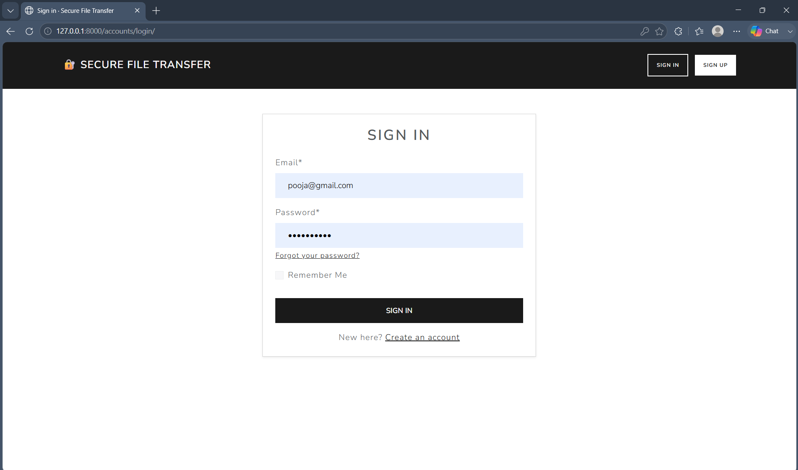
*The login screen — email + password via `django-allauth`. Anonymous visitors hitting `/` are redirected here.*

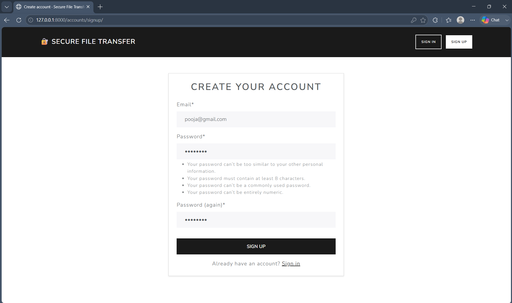
*Sign-up form — email is the unique identifier, no username required.*

### Upload Flow

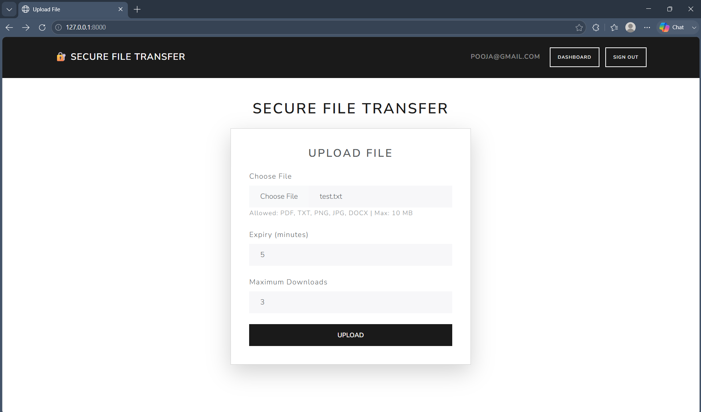
*The upload form — pick a file, set an expiry time in minutes, and choose a max download count. Only logged-in users can see this view.*

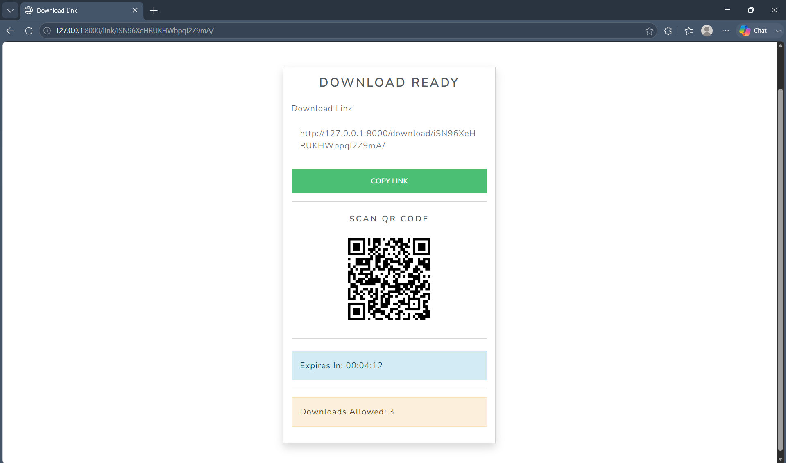
*After a successful upload: a one-time shareable link, a live countdown to expiry, and the remaining download count.*


*The QR code rendered on the success page so recipients can scan and grab the file on mobile.*

### Download Flow

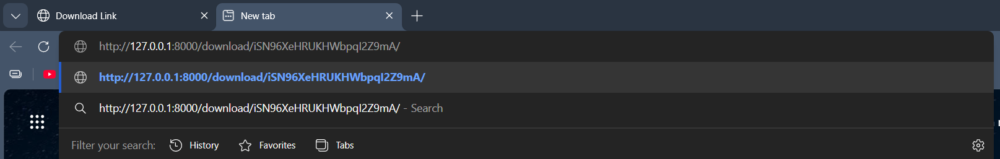
*The recipient opens the shareable link in their browser — no login required, the token is the capability.*

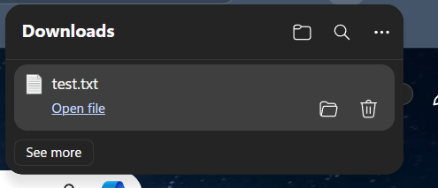
*The decrypted file is delivered to the recipient. The download counter ticks down atomically — no two requests can claim the final slot.*

### Dashboard

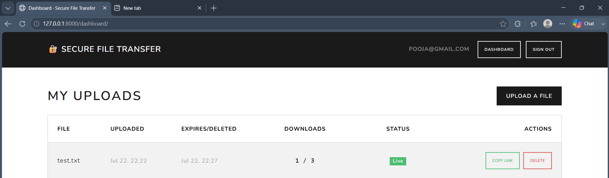
*The user-scoped dashboard — every upload the logged-in user has made, with status badges, one-click link copy, and an owner-only delete button.*

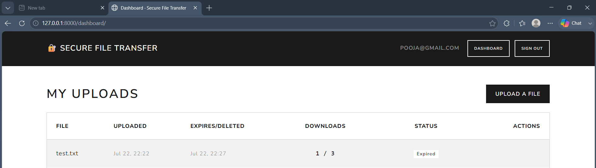
*The same dashboard after a link has expired: the `DeletedUpload` audit row keeps the metadata visible, so the user can still see what happened.*

### Encryption Proof

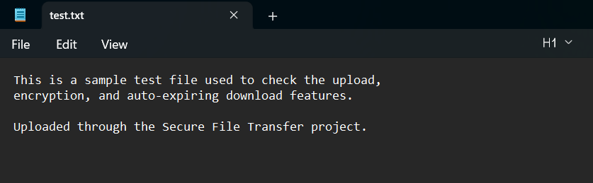
*The original file as uploaded by the sender — this is the plaintext baseline.*

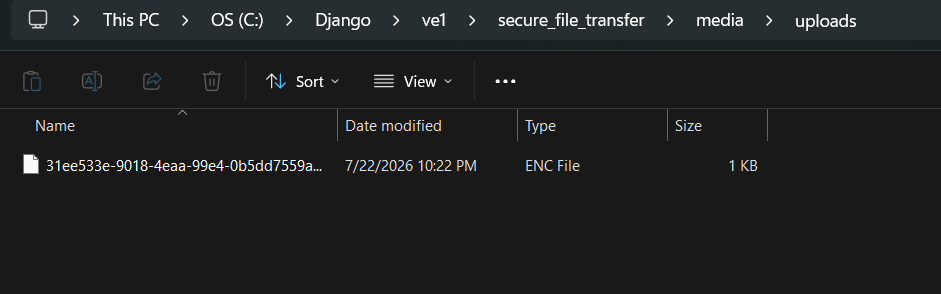
*What's actually written to disk — ciphertext, not plaintext. Even with full access to `MEDIA_ROOT`, the file is unreadable without the Fernet key.*

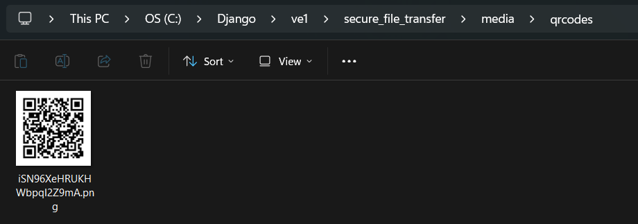
*The generated QR code is also written to `MEDIA_ROOT` alongside the encrypted blob.*

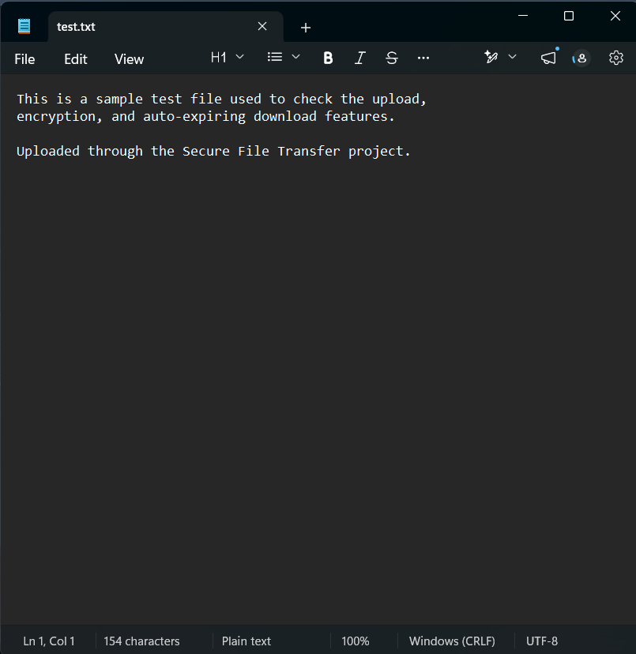
*After decryption on download, the bytes match the original upload — round-trip integrity confirmed.*

### Auto-Cleanup Proof

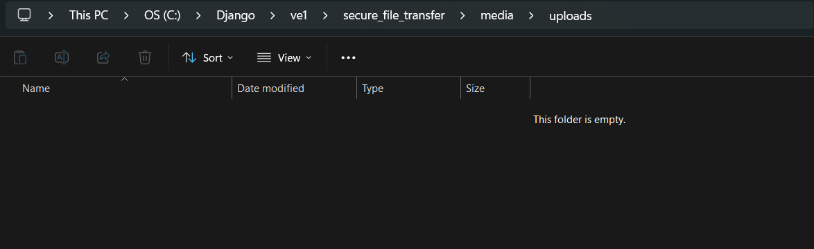
*Once the link expires or the download cap is hit, the encrypted blob is wiped from `MEDIA_ROOT` automatically — no manual cleanup needed.*


*The QR code is removed alongside the encrypted blob. Subsequent requests to the link render the "File Unavailable" page.*

### Starting the App

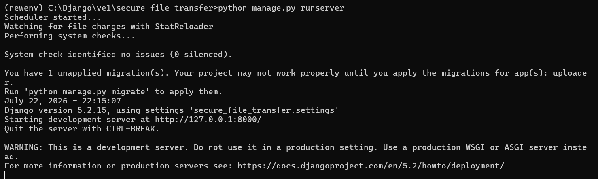
*The Django development server running locally. Visit http://127.0.0.1:8000/ to start uploading.*

---

## Security Notes

- **At-rest encryption:** every upload is encrypted with Fernet before it touches disk. The key never leaves the server. Tampered ciphertext raises `InvalidToken` and is treated as expired.
- **Race-safe quota:** the download counter is incremented inside `transaction.atomic()` with `select_for_update()` so two simultaneous downloads can't both win the last slot (see [Challenges Faced](#-challenges-faced)).
- **Anonymous download, authenticated ownership:** anyone with the token can download, but the dashboard and manual-delete are gated on `request.user` matching the `FileUpload.user` FK inside the queryset.
- **`DeletedUpload` audit log:** deletions are recorded *before* the ciphertext is wiped, so the dashboard can show what happened without keeping plaintext.
- **Defence-in-depth on uploads:** the form checks size, extension, *and* MIME type. The MIME check uses the browser-supplied `content_type`, which a client can forge — for production, swap it for a magic-byte check via `python-magic` (libmagic) so the type is derived from actual bytes. Tracked as a deployment task.
- **Auto-cleanup:** APScheduler runs `delete_expired` every minute so stale blobs don't pile up.

### Production checklist

- `DEBUG = False`; move `SECRET_KEY` and the Fernet key to env vars (or a KMS)
- Set `EMAIL_BACKEND` to real SMTP/SendGrid (the dev setting prints to console)
- Switch SQLite → PostgreSQL via the already-wired `DATABASE_URL`
- Serve `MEDIA_ROOT` from private storage (not a public CDN)
- HTTPS + rate limiting
- Magic-byte MIME validation via `python-magic`

---

## Running the Tests

```bash
python manage.py test
```

The suite covers:

- `EncryptionRoundTripTest` — encrypt → decrypt returns the original bytes
- `UploadFormValidationTest` — bad extensions and oversize files are rejected
- `DownloadLimitTest` — quota decrements correctly and the file is wiped at the cap
- `ExpiryTest` — past-due files render the expired page and are cleaned up
- `ShowLinkExpiredTest` — expired or fully-spent files render the expired page on the link view

Tests write uploads to a temporary `MEDIA_ROOT` so they never touch your real `media/` folder.

---

## Configuration

| Setting                | Default                  | Where                |
|------------------------|--------------------------|----------------------|
| Max upload size        | `10 MB`                  | `uploader/forms.py`  |
| Allowed extensions     | `pdf, txt, png, jpg, jpeg, docx, zip` | `uploader/forms.py` |
| Allowed MIME types     | See `ALLOWED_TYPES`      | `uploader/forms.py`  |
| Cleanup interval       | Every 1 minute           | `uploader/scheduler.py` |
| Time zone              | `Asia/Kolkata`           | `settings.py`        |

---

## Challenges Faced

- **Race condition on the download quota.** A naive `download_count + 1; row.save()` lets two concurrent requests both claim the last slot. **Fix:** wrapped the read-and-increment in `transaction.atomic()` with `select_for_update()` and used an `F()` expression so the row is locked for the transaction's duration and the increment happens in SQL, not in Python.
- **APScheduler lifecycle in Django.** APScheduler doesn't auto-stop when `runserver` reloads, leaking threads on every code change. **Fix:** start a single scheduler in `AppConfig.ready()` with `apps.py` guards against the auto-reloader spawning the app twice, and let the process lifecycle handle shutdown.
- **MIME-type validation that isn't actually trustworthy.** I initially planned to validate by `request.FILES['file'].content_type`, but that header is set by the client and can be anything — a `.exe` can pretend to be a `.pdf`. **Fix (partial):** kept the client-supplied MIME check as a first line of defence, with the proper fix (magic-byte detection via `python-magic`) left as a deployment task since adding `libmagic` is an environment concern, not a code one.
- **Fernet key loss = total data loss.** Deleting or rotating `secret.key` without re-encrypting makes every prior upload unreadable. **Fix:** the key is gitignored, its path is documented, and `generate_key` makes the bootstrap explicit. (Future: env var or KMS — see [Future Improvements](#-future-improvements).)
- **Stale blobs from quota-zeroed downloads.** Without a background job, files whose quota hits zero sit on disk forever. **Fix:** APScheduler-driven `delete_expired()` runs every minute; the download view also deletes inline as defence-in-depth so a user hitting the cap doesn't have to wait up to 60s.
- **User-scoped data without leaking across accounts.** The dashboard must list only the requesting user's uploads, and the manual-delete endpoint must refuse to delete someone else's. **Fix:** dashboard uses `FileUpload.objects.filter(user=request.user)`; `delete_file` re-checks the FK in `get(token=..., user=request.user)`, so a guessed token from another user's URL just 404s.
- **Shortening share links without losing entropy.** Raw UUID4s (36 chars, hyphens included) are clunky in URLs and QR codes. **Fix:** `tokens.generate_token()` base64-url-encodes the same 16 random bytes and strips `=` padding → 22 characters, identical 128-bit entropy. The new `CharField` has `default=generate_token`, so every new write gets a short token automatically.
- **Soft delete vs hard delete for an audit trail.** The original code just deleted the row when a file was wiped, so the dashboard couldn't show "this used to be here." **Fix:** a separate `DeletedUpload` model captures metadata (name, type, max downloads, download count, user, timestamps, and a `manual` / `expired` / `quota` reason) before `cleanup_file()` removes the blob, QR, and `FileUpload` row. The dashboard merges active and deleted rows into one table with status badges.
- **Email-as-identifier auth setup.** allauth's defaults assume a username, and switching to email-only requires opting out of the username field on every form. **Fix:** `ACCOUNT_AUTHENTICATION_METHOD = 'email'`, `ACCOUNT_USERNAME_REQUIRED = False`, `ACCOUNT_UNIQUE_EMAIL = True` in `settings.py`, plus custom `account/{login,signup,logout}.html` templates so the auth screens match the rest of the site.

---

## Future Improvements

Things I'd add if this were production-bound:

- **Magic-byte MIME validation** via `python-magic` / libmagic — derive the content type from the file's actual bytes instead of the client-supplied header.
- **Virus scanning** before encryption (e.g. ClamAV via `clamd` or a hosted API) so malicious payloads don't get re-served from a trusted URL.
- **Password-protected share links** — require a per-upload passphrase on download in addition to the token.
- **Email sharing** — let the sender type a recipient address and have the app mail the link instead of (or alongside) the QR code.
- **Download analytics** — per-link event log: timestamp, IP, user-agent, outcome (success / expired / quota-spent), surfaced in the dashboard.
- **Rate limiting** on upload and download endpoints (e.g. `django-ratelimit`) to slow down enumeration and brute force.
- **Key management** via env var or a KMS (AWS KMS, GCP KMS, HashiCorp Vault) instead of a file on disk, with a re-encrypt job for key rotation.
- **AWS S3 / object storage** for `MEDIA_ROOT` so blobs live in private, durable storage rather than on the app server's filesystem.
- **Redis + Celery** for background jobs in production — APScheduler is fine for a single-process demo, but a real deployment wants the sweeper decoupled from the web tier and horizontally scalable.
- **Docker / docker-compose** for a one-command spin-up of Django + Postgres + Redis + an Nginx reverse proxy serving `MEDIA_ROOT` privately.

---

## License

This project is released under the **MIT License**. See [`LICENSE`](LICENSE) for details.

---

## Author

Built by Pooja Shree R

Computer Science Engineering Student  
Interested in Cybersecurity and Backend Development

Feel free to connect or contribute.